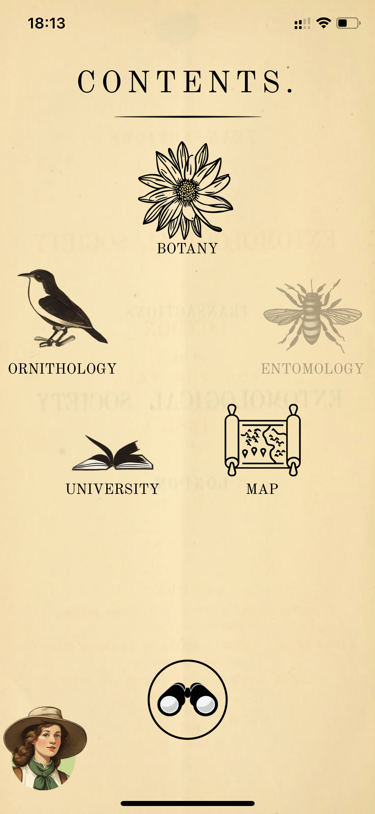
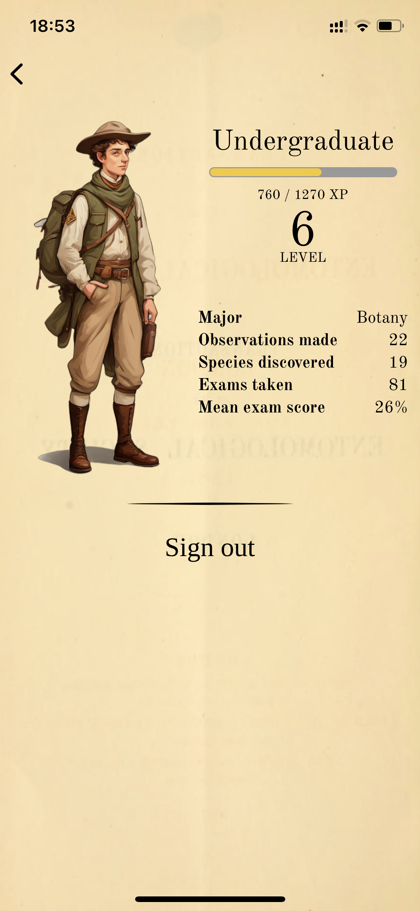
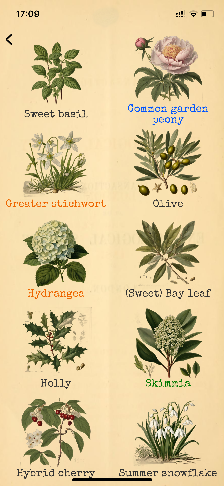
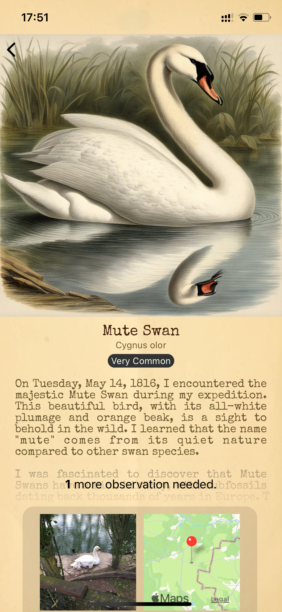
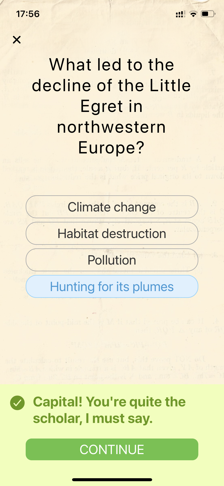
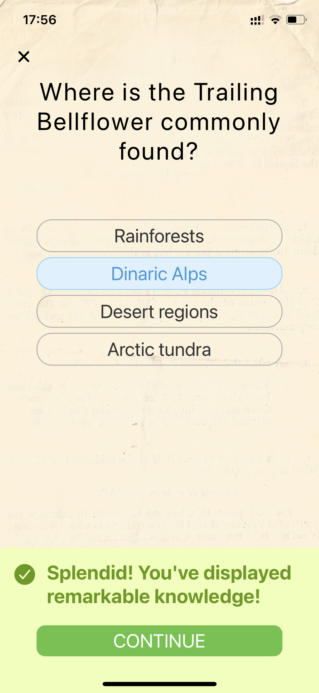

# Nature GO 

A generative AI project

 

 

  

  

## Credit

- Inspired by the [Biodiversity Heritage Library](https://www.flickr.com/photos/61021753@N02/)
- Plant data from [GBIF](https://www.gbif.org/)
- Bird data from [Avibase](https://avibase.bsc-eoc.org/avibase.jsp)
- Plant identification with [Pl@ntNet API](https://my.plantnet.org/)
- Bird identification with [Gemini Pro Vision](https://deepmind.google/technologies/gemini/)
- Illustration generation with [Stable Diffusion XL](https://stability.ai/stable-image)
- Description and quiz generation with [gpt-3.5-turbo](https://platform.openai.com)
