#  Nature GO

<h4 align="center">A wildlife identification game — become a 19th century naturalist</h4>

This project experiments with generative AI to create an engaging and educational wildlife identification experience, by allowing users to roleplay as a naturalist from the 1800s. The visual identity draws inspiration from scientific illustrations of the era. I acknowledge the limitations of this technology in terms of factuality, and ground generated content on open access resources whenever possible.

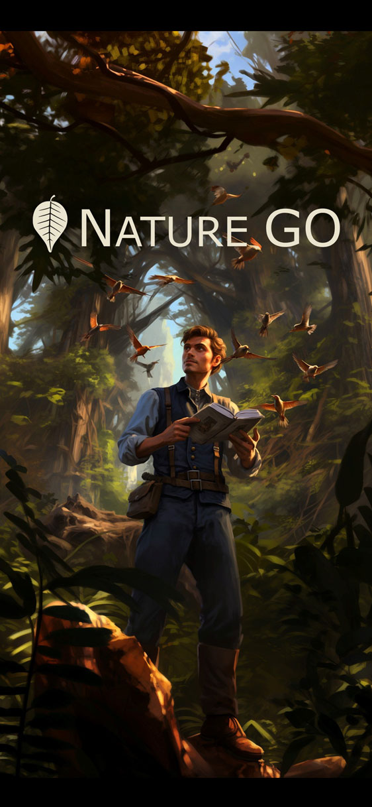 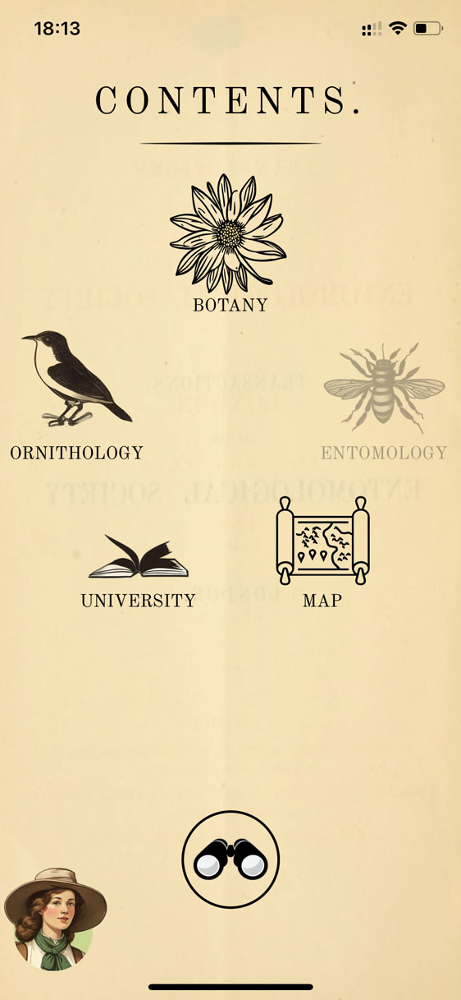 

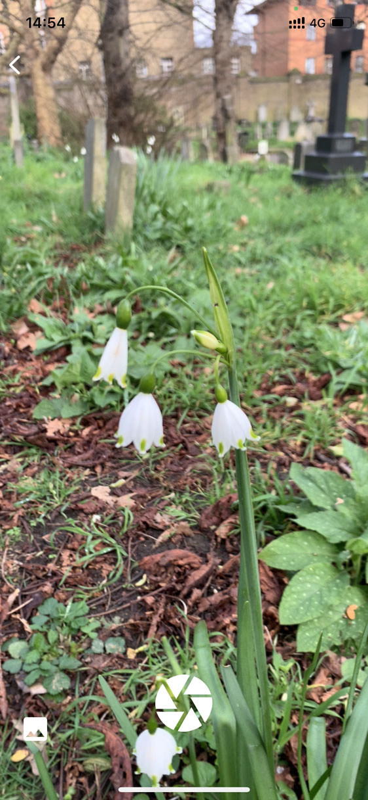 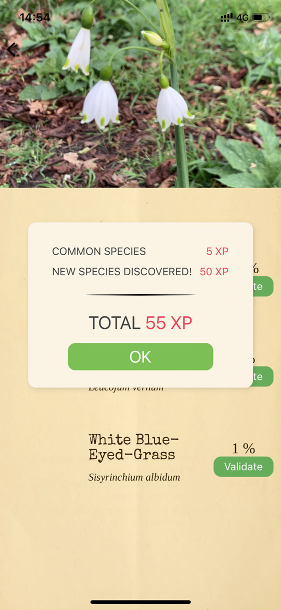 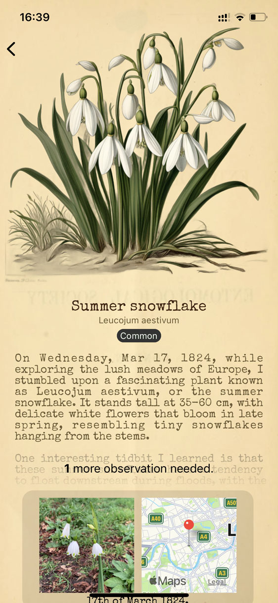

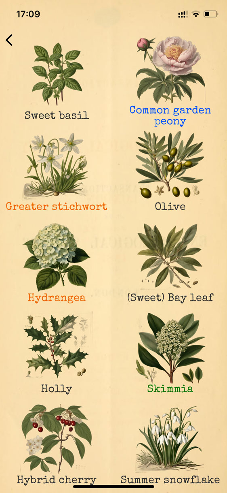 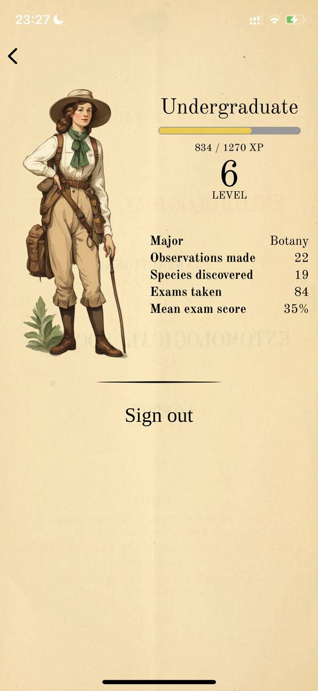 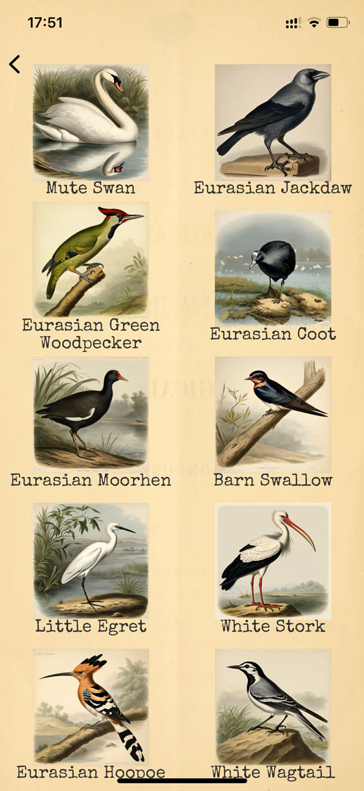

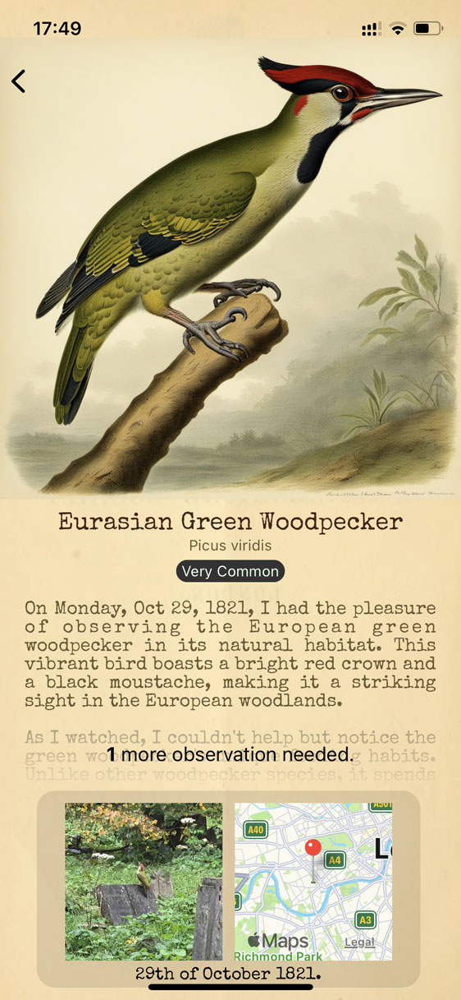 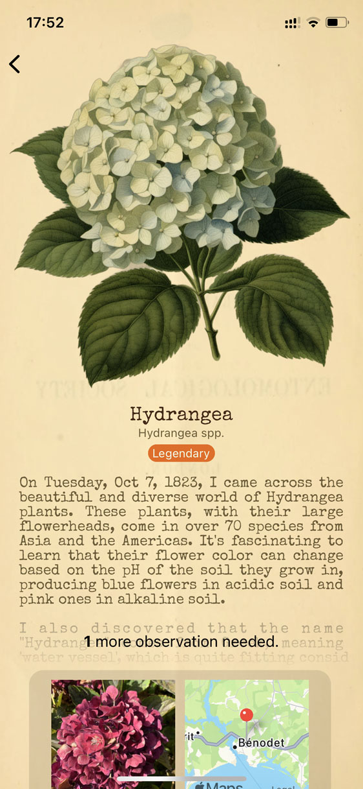 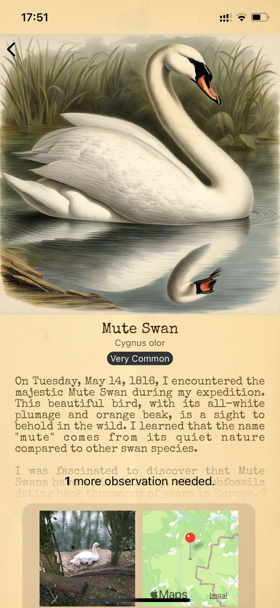

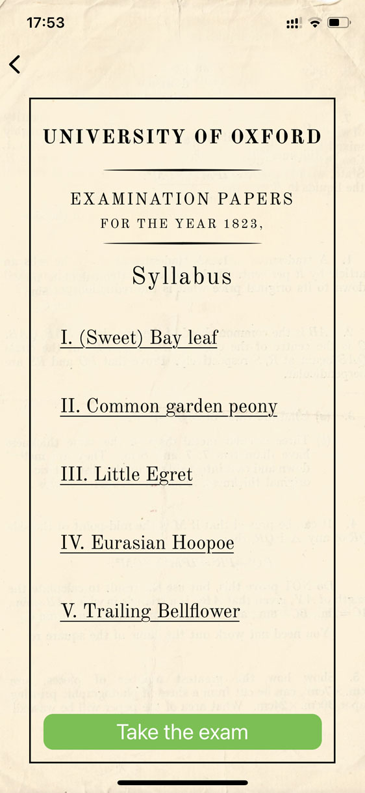 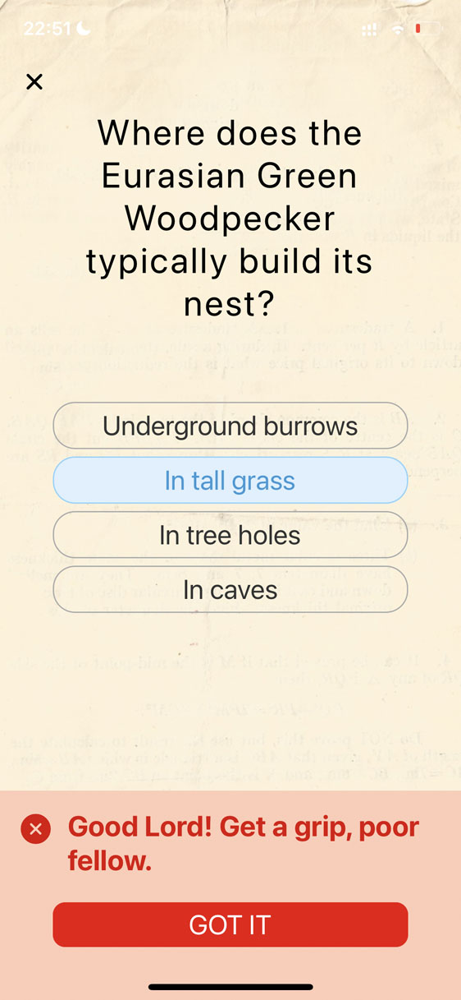 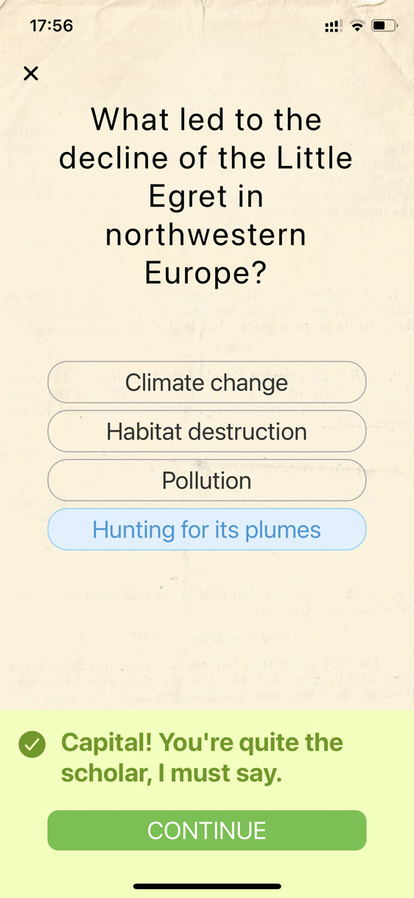

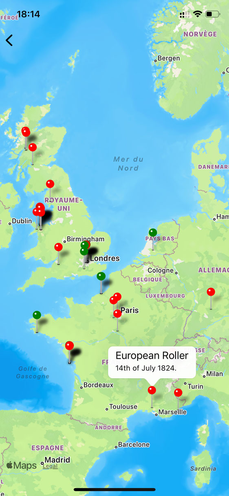

## Try it

🌐 **Web App**: [edouardleurent.com/nature-go](https://edouardleurent.com/nature-go/)

### Install as an App (PWA)

Nature GO is a Progressive Web App that can be installed on your device for a native app-like experience:

**iOS (Safari)**
1. Open the web app in Safari
2. Tap the **Share** button (square with arrow)
3. Scroll down and tap **Add to Home Screen**
4. Tap **Add** to confirm

**Android (Chrome)**
1. Open the web app in Chrome
2. Tap the **three-dot menu** (⋮)
3. Tap **Install app** or **Add to Home Screen**
4. Tap **Install** to confirm

## Credit

- Inspired by the [Biodiversity Heritage Library](https://www.flickr.com/photos/61021753@N02/) and [Pokémon GO](https://pokemongolive.com/)
- Plant data from [GBIF](https://www.gbif.org/)
- Bird data from [Avibase](https://avibase.bsc-eoc.org/avibase.jsp)
- Species details from [Wikipedia](https://en.wikipedia.org)
- Plant identification with [Pl@ntNet API](https://my.plantnet.org/)
- Bird identification with [Gemini 3 Flash](https://deepmind.google/technologies/gemini/)
- Illustration generation with [Imagen 3](https://deepmind.google/technologies/imagen-3/)
- Description and quiz generation with [Gemini 3 Flash](https://deepmind.google/technologies/gemini/)
- Backend with [Django](https://www.djangoproject.com/), frontend with [Next.js](https://nextjs.org/)

Support your local community — [:uk:](https://www.rspb.org.uk), [:fr:](https://www.lpo.fr/).

