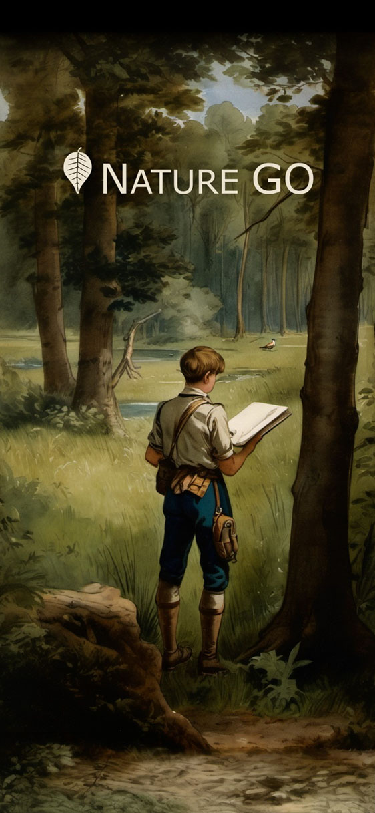
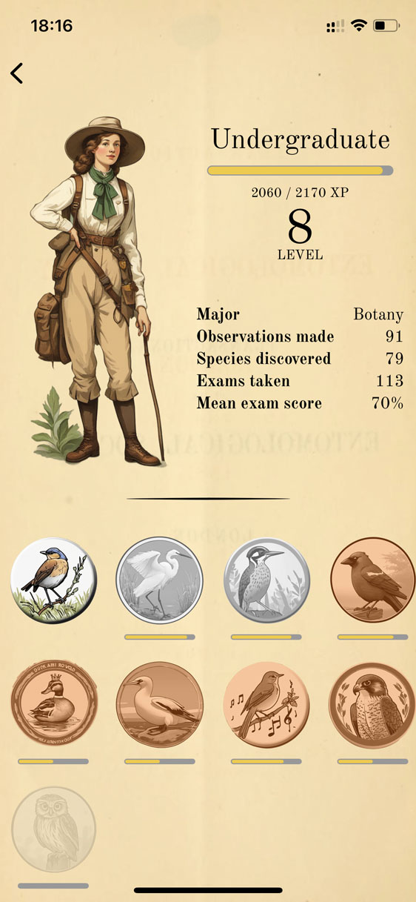

#  Nature GO

<h4 align="center">A wildlife identification game — become a 19th century naturalist</h4>

This project experiments with generative AI to create an engaging and educational wildlife identification experience, by allowing users to roleplay as a naturalist from the 1800s. The visual identity draws inspiration from scientific illustrations of the era. I acknowledge the limitations of this technology in terms of factuality, and ground generated content on open access resources whenever possible.

  

  

  

  

  

## Install

This project is still in development, and not available on App Stores yet.

You can preview the latest development version on Android & iOS using the [Expo Go](https://expo.dev/go) sandbox app, with this QR code

## Credit

- Inspired by the [Biodiversity Heritage Library](https://www.flickr.com/photos/61021753@N02/) and [Pokémon GO](https://pokemongolive.com/)
- Plant data from [GBIF](https://www.gbif.org/)
- Bird data from [Avibase](https://avibase.bsc-eoc.org/avibase.jsp)
- Species details from [Wikipedia](https://en.wikipedia.org)
- Plant identification with [Pl@ntNet API](https://my.plantnet.org/)
- Bird identification with [Gemini 1.5 Flash](https://deepmind.google/technologies/gemini/)
- Illustration generation with [Stable Diffusion XL](https://stability.ai/stable-image)
- Description and quiz generation with [Gemini 1.5 Flash](https://deepmind.google/technologies/gemini/)
- Backend with [django](https://www.djangoproject.com/), frontend with [React Native](https://reactnative.dev/)

Support your local community — [:uk:](https://www.rspb.org.uk), [:fr:](https://www.lpo.fr/).
